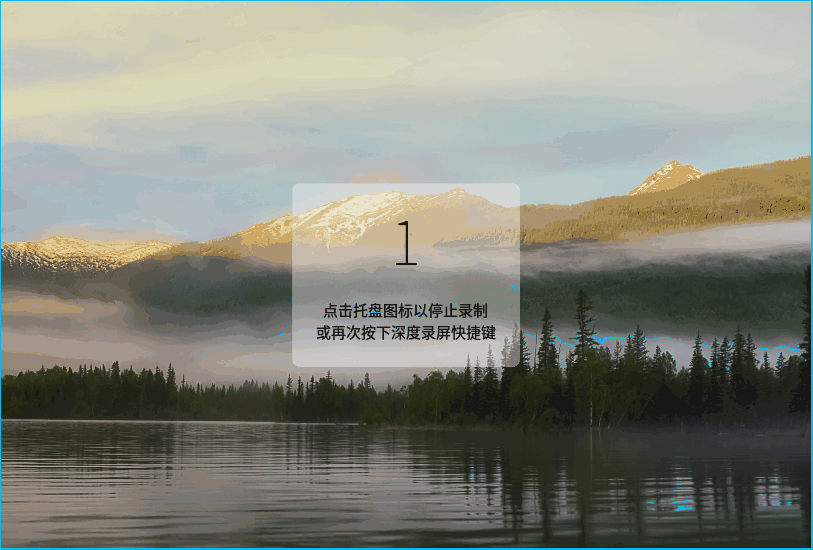

# Mind Flash

It's a flash over your mind. 

### Preview

### Usage

|    Function     |                 Shortcut                 |
| :-------------: | :--------------------------------------: |
|  Quick Launch   | <kbd>Ctrl</kbd> + <kbd>Alt</kbd> + <kbd>m</kbd> |
|    Next Line    | <kbd>Ctrl</kbd> + <kbd>Return</kbd> OR <kbd>Enter</kbd> |
|    Save&Exit    |            <kbd>Return</kbd>             |
|                 |                                          |
|  Popup History  |         Double <kbd>click</kbd>          |
|  History - Day  | <kbd>Alt</kbd> + <kbd>v</kbd> |
| History - Week  | <kbd>Alt</kbd> + <kbd>vv</kbd> |
| History - Month | <kbd>Alt</kbd> + <kbd>vvv</kbd> |
|  Last History   | <kbd>Alt</kbd> + <kbd>k</kbd> |
|  Next History   | <kbd>Alt</kbd> + <kbd>j</kbd> |

> for now, you should bind the `quick launch` shortcut by yourself

### TODO

- [x] Add GUI, Shortcuts Binding
- [x] Single Instance (now with socket)
- [x] Add Index Function, and Day Splitter
- [x] Implement Complex Key Binding
- [ ] Implement Fetch Function
- [ ] Add rsync function, with Private Key
- [ ] Clipboard Images
- [ ] Listview for History
- [ ] Listview for Todolist
- [ ] Add Chinese Characters Support
- [ ] port to Android
