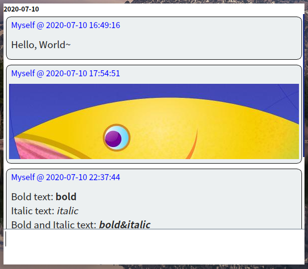

# Mind Flash

It's a flash over your mind. 

## Install

The latest *multi-platform* binary packages are available on [release page](https://github.com/iamhyc/mind-flash/releases/latest).
- [Download Linux Deb Package](https://github.com/iamhyc/mind-flash/releases/latest/download/mind-flash-linux-all.deb)
- [Download Windows Tray Version](https://github.com/iamhyc/mind-flash/releases/latest/download/mind-flash-win32-tray.zip)

**Manual build:**

1. Have `python3` and `python3-pip` (latest version) installed;

2. Download this repository, and execute `make` in the repository folder;
   
    > It will automatically download the requirements, and install itself in system (need root privilege).
    
3. Use `msh-gui` to display GUI, and `msh` for CLI.
   
    > The default shortcut binding for gnome/dde is: <kbd>Super</kbd> + <kbd>N</kbd>.

## Usage

**Basic usage:**

| Default Shortcuts |                 Function                 |
| :-------------: | :--------------------------------------: |
| <kbd>Super</kbd> + <kbd>N</kbd> | Quick Launch |
|    <kbd>Ctrl</kbd> + <kbd>Return</kbd> OR <kbd>Enter</kbd>    | Next Line |
|    <kbd>Return</kbd>    |            Save&Exit    |
|                 |                                          |
|  Double <kbd>click</kbd>  |     Popup History |
|  <kbd>Alt</kbd> + <kbd>v</kbd>  | History - Week |
| <kbd>Alt</kbd> + <kbd>vv</kbd> | History - Month |
| <kbd>Alt</kbd> + <kbd>vvv</kbd> | History - Year |
| <kbd>Alt</kbd> + <kbd>k</kbd> | Last piece of History |
| <kbd>Alt</kbd> + <kbd>j</kbd> | Next piece of History |
* `*italic_text*`, `**bold_text**` render support when input
* <kbd>Ctrl</kbd> + <kbd>V</kbd> support pasting plaintext or image

**Todolist usage**:

* <kbd>Alt</kbd> + <kbd>Q</kbd> to add current text to todolist
* Right click on item to toggle completion status
* (not support item deletion now)

## License
This project is licensed under [GPLv3](LICENSE).
