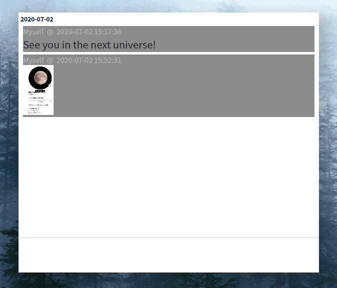

# Mind Flash

It's a flash over your mind. 

### Preview

### Install

1. Have `python3` and `python3-pip` installed;

2. Download this repository, and execute `make` in the repository folder;
    > It will automatically download the requirements, and install in the system (need root privilege)

3. use `msh-gui` to display GUI (`msh --help` for detail usage), and `msh` for CLI.
    > Suggest to add a global shortcut for `msh-gui`, e.g., <kbd>Super</kbd> + <kbd>N</kbd>.

### Usage

| Default Shortcuts |                 Function                 |
| :-------------: | :--------------------------------------: |
| <kbd>Super</kbd> + <kbd>N</kbd> | Quick Launch |
|    <kbd>Ctrl</kbd> + <kbd>Return</kbd> OR <kbd>Enter</kbd>    | Next Line |
|    <kbd>Return</kbd>    |            Save&Exit    |
|                 |                                          |
|  Double <kbd>click</kbd>  |     Popup History |
|  <kbd>Alt</kbd> + <kbd>v</kbd>  | History - Week |
| <kbd>Alt</kbd> + <kbd>vv</kbd> | History - Month |
| <kbd>Alt</kbd> + <kbd>vvv</kbd> | History - Year |
| <kbd>Alt</kbd> + <kbd>k</kbd> | Last piece of History |
| <kbd>Alt</kbd> + <kbd>j</kbd> | Next piece of History |

### TODO
This project is still under development.

The future feature list is moved to `Issues` section on Github.
