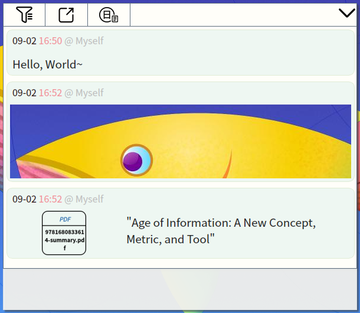

# Mind Flash

It's a flash over your mind. 

## Install

The latest out-of-the-box packages are available on [release page](https://github.com/iamhyc/mind-flash/releases/latest).

**Manual build:**

1. Have `python3` and `python3-pip` (latest version) installed;

2. Download this repository, and execute `make` in the repository folder;
   
    > It will automatically download the requirements, and install itself in system (need root privilege).
    
3. Run `msh-userfix` in your terminal (support gnome or dde desktop), and then try <kbd>Super</kbd> + <kbd>N</kbd> to start the journey.
   
    > This script will fix default shortcut binding for current user, and functions for Fcitx input method.
    > If nothing happened, try manually add the custom key binding to `/usr/bin/msh-gui` for your used desktop.
    
4. (Optional) Build platform-dependent distribution package by run `make build-dist`, and the package will be generated in `./dist` folder.

## Usage

**Basic Usage:**

| Default Shortcuts |                 Function                 |
| :-------------: | :--------------------------------------: |
| <kbd>Super</kbd> + <kbd>N</kbd> | Launch |
|    <kbd>Escape</kbd> OR <kbd>Ctrl</kbd>+<kbd>W</kbd>    | Close |
| Double <kbd>click</kbd> | Show/Hide History |
| <kbd>Ctrl</kbd> + <kbd>Return</kbd> OR <kbd>Enter</kbd> | Next Line |
|    <kbd>Return</kbd>    |          Save & Exit    |

**Todo List Usage**: please refer to tooltip by hovering over the `TODO LIST` title.

**Other Usages:**

- Input
    - support `**bold_text**` and `*italic_tex*` Markdown style rendering
    - support `<a href="">...</a>` hyperlink, open via system browser
    - support screenshot (pixmap) pasting action
    - support file(s) darg-and-drop pasting action

- History View
    - **Jump to Last/Next History**: *keep scrolling* upward/downward on the history record list until the history reloaded
    - **Switch History Record Type**: click `History` icon on the toolbar (show when hover on the top-side)
    - **Filter the History**: click `Filter` icon on the toolbar, input the keyword (now only support regex) and press ENTER to apply
    - **Export the History**: click `Export` icon on the toolbar, then export the current display records to your Desktop (in Markdown style)
    - **Shortcuts**: Apply history jump backword by `Alt+K`, jump forward by `Alt+J`; history record type switch by `Alt+V`

- History Edit
    - **Cite a Record**: *Double-click* on one record (toegther with the image/file contained)
    - **Remove a Record**: *Double-click twice* to permanently remove the record

- Image Preview:
    - **Copy to Clipboard**: right-click on the thumbnail
    - **Pop-up Previewer**: left-click on the thumbnail to pop up a *preview widget*
    - **Image Previewer**: scroll on the iamge for zooming; drag to move; focus lose to close

- File Preview
    - **Copy to Clipbarod**: right-click on the thumbnail
    - **Open**: left-click on thumbnail to open the containing folder

## License
This project is licensed under [GPLv3](LICENSE).
